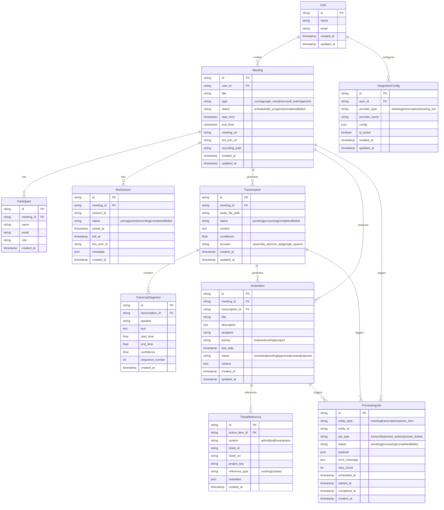

# Domain Model Documentation

## Entity Relationship Diagram

## Domain Entities

### User
The root entity representing a system user.

**Attributes:**
- `id`: Unique identifier
- `name`: User's display name
- `email`: User's email address (unique)
- `created_at`, `updated_at`: Audit timestamps

**Relationships:**
- One-to-many with Meetings
- One-to-many with IntegrationConfigs

### Meeting
Core entity representing a meeting session.

**Attributes:**
- `id`: Unique identifier
- `user_id`: Reference to the meeting creator
- `title`: Meeting title/subject
- `type`: Meeting platform (zoom, google_meet, microsoft_teams, generic)
- `status`: Current meeting state
- `start_time`, `end_time`: Meeting duration
- `meeting_url`: Original meeting URL
- `bot_join_url`: Bot-specific join URL (if different)
- `recording_path`: Path to recorded audio/video file

**Status Values:**
- `scheduled`: Meeting created but not started
- `in_progress`: Meeting is active
- `completed`: Meeting finished successfully
- `failed`: Meeting processing failed

### Participant
Represents individuals who attended the meeting.

**Attributes:**
- `meeting_id`: Reference to the meeting
- `name`: Participant's name
- `email`: Participant's email (optional)
- `role`: Participant's role in the meeting (optional)

### BotSession
Tracks the bot's participation in a meeting.

**Attributes:**
- `meeting_id`: Reference to the meeting
- `session_id`: External bot session identifier
- `status`: Bot's current state
- `joined_at`, `left_at`: Bot participation timeframe
- `bot_user_id`: Bot's user ID in the meeting platform
- `metadata`: Additional bot-specific data

### Transcription
Contains the transcribed content of a meeting.

**Attributes:**
- `meeting_id`: Reference to the source meeting
- `audio_file_path`: Path to the audio file
- `status`: Processing status
- `content`: Full transcribed text
- `confidence`: Overall transcription confidence score
- `provider`: Transcription service used

### TranscriptSegment
Individual segments of the transcription with speaker attribution.

**Attributes:**
- `transcription_id`: Reference to the parent transcription
- `speaker`: Speaker identification
- `text`: Segment content
- `start_time`, `end_time`: Temporal boundaries
- `confidence`: Segment-specific confidence score
- `sequence_number`: Order within the transcription

### ActionItem
Extracted actionable items from the meeting.

**Attributes:**
- `meeting_id`: Reference to the source meeting
- `transcription_id`: Reference to the source transcription
- `title`: Action item summary
- `description`: Detailed description
- `assignee`: Person responsible (optional)
- `priority`: Urgency level
- `due_date`: Target completion date (optional)
- `status`: Processing status
- `context`: Original transcript context

**Priority Values:**
- `low`, `medium`, `high`, `urgent`

**Status Values:**
- `extracted`: Identified from transcript
- `pending`: Awaiting user approval
- `approved`: User approved for ticket creation
- `created`: Ticket successfully created
- `rejected`: User rejected the action item

### TicketReference
Links action items to external ticketing systems.

**Attributes:**
- `action_item_id`: Reference to the action item
- `system`: Ticketing platform identifier
- `ticket_id`: External ticket identifier
- `ticket_url`: Direct link to the ticket
- `project_key`: Project/repository identifier
- `reference_type`: Whether ticket was existing or newly created
- `metadata`: System-specific additional data

### IntegrationConfig
User's configuration for external service integrations.

**Attributes:**
- `user_id`: Reference to the user
- `provider_type`: Type of integration (ticketing, transcription, meeting_bot)
- `provider_name`: Specific provider (github, jira, assembly_ai, etc.)
- `config`: Provider-specific configuration (API keys, endpoints, etc.)
- `is_active`: Whether this configuration is currently active

### ProcessingJob
Tracks asynchronous processing tasks.

**Attributes:**
- `entity_type`: Type of entity being processed
- `entity_id`: Identifier of the entity
- `job_type`: Type of processing task
- `status`: Current job status
- `payload`: Job-specific data
- `error_message`: Error details if failed
- `retry_count`: Number of retry attempts
- `scheduled_at`, `started_at`, `completed_at`: Job lifecycle timestamps

## Value Objects

### Email (User Module)
Encapsulates email validation and formatting.

### Priority (ActionItem Module)
Represents action item priority with validation.

### MeetingType (Meeting Module)
Enumeration of supported meeting platforms.

### TranscriptionProvider (Transcription Module)
Identifies the transcription service used.

## Domain Services

### MeetingOrchestrator
Coordinates the entire meeting processing workflow.

### TranscriptionService
Manages transcription provider selection and processing.

### ActionItemExtractionService
Handles AI-powered action item extraction from transcripts.

### TicketingService
Manages ticket creation and linking across multiple platforms.

## Repository Interfaces

Each domain entity has a corresponding repository interface:

- `UserRepository`
- `MeetingRepository`
- `TranscriptionRepository`
- `ActionItemRepository`
- `TicketReferenceRepository`
- `IntegrationConfigRepository`
- `ProcessingJobRepository`

All repositories extend the base `Repository[T]` interface with entity-specific query methods. 