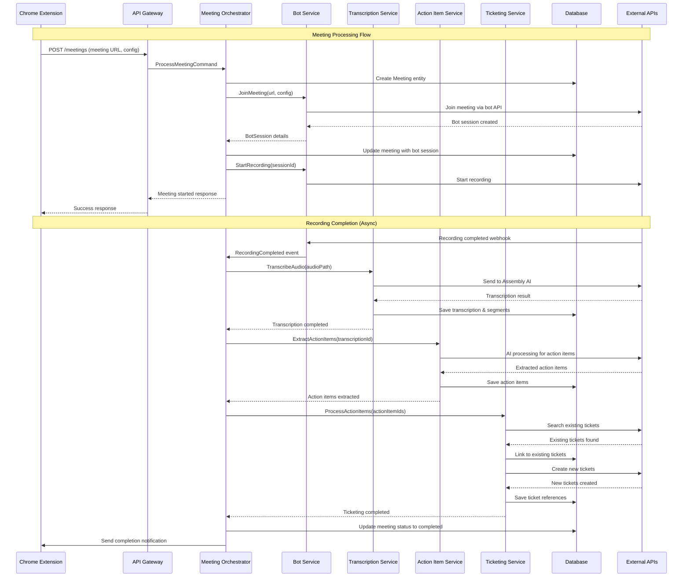
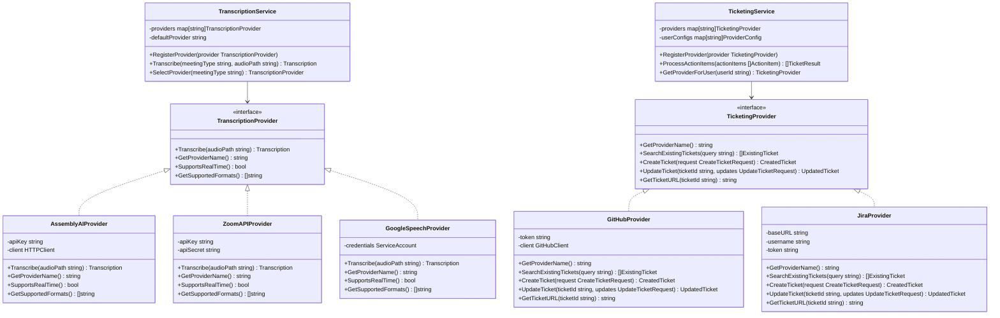
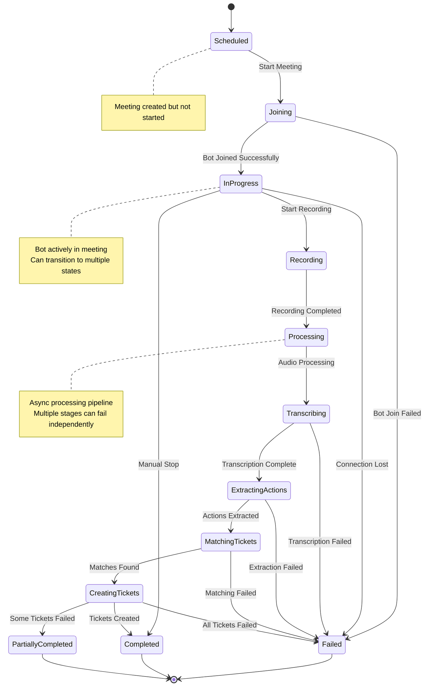

# System Architecture Documentation

## Module Architecture Overview

```mermaid
graph TB
    subgraph "Chrome Extension (WXT)"
        CE[Content Scripts]
        CP[Popup Interface]
        CB[Background Service]
        CE --> CP
        CP --> CB
    end
    
    subgraph "API Gateway"
        AG[HTTP Router]
        AM[Auth Middleware]
        AG --> AM
    end
    
    subgraph "Meeting Module"
        subgraph "Meeting Domain"
            ME[Meeting Entity]
            MP[Participant Entity]
            MBS[Bot Session Entity]
            MR[Meeting Repository]
        end
        
        subgraph "Meeting Application"
            MOC[Meeting Orchestrator]
            MCH[Meeting Command Handlers]
            MQH[Meeting Query Handlers]
        end
        
        subgraph "Meeting Infrastructure"
            MRI[Meeting Repo Implementation]
            MBP[Meeting Bot Providers]
        end
    end
    
    subgraph "Transcription Module"
        subgraph "Transcription Domain"
            TE[Transcription Entity]
            TS[Transcript Segment Entity]
            TR[Transcription Repository]
            TSS[Transcription Service]
        end
        
        subgraph "Transcription Application"
            TCH[Transcription Command Handlers]
            TQH[Transcription Query Handlers]
        end
        
        subgraph "Transcription Infrastructure"
            TRI[Transcription Repo Implementation]
            AAI[Assembly AI Provider]
            ZAP[Zoom API Provider]
            GSP[Google Speech Provider]
        end
    end
    
    subgraph "Action Item Module"
        subgraph "Action Item Domain"
            AIE[Action Item Entity]
            AIR[Action Item Repository]
            AIS[Action Item Service]
        end
        
        subgraph "Action Item Application"
            AICH[Action Item Command Handlers]
            AIQH[Action Item Query Handlers]
            AIES[Action Item Extraction Service]
        end
        
        subgraph "Action Item Infrastructure"
            AIRI[Action Item Repo Implementation]
            AILP[AI Language Processing]
        end
    end
    
    subgraph "Ticketing Module"
        subgraph "Ticketing Domain"
            TRE[Ticket Reference Entity]
            TRR[Ticket Reference Repository]
            TIS[Ticketing Service]
        end
        
        subgraph "Ticketing Application"
            TICH[Ticketing Command Handlers]
            TIQH[Ticketing Query Handlers]
        end
        
        subgraph "Ticketing Infrastructure"
            TIRI[Ticketing Repo Implementation]
            GHP[GitHub Provider]
            JP[Jira Provider]
            LP[Linear Provider]
        end
    end
    
    subgraph "Integration Module"
        subgraph "Integration Domain"
            ICE[Integration Config Entity]
            ICR[Integration Config Repository]
        end
        
        subgraph "Integration Application"
            ICCH[Integration Command Handlers]
            ICQH[Integration Query Handlers]
        end
        
        subgraph "Integration Infrastructure"
            ICRI[Integration Repo Implementation]
            EXT[External API Clients]
        end
    end
    
    subgraph "Shared Infrastructure"
        DB[(PostgreSQL Database)]
        FS[File Storage]
        MQ[Message Queue]
        LOG[Logging Service]
    end
    
    %% Connections
    CB --> AG
    AG --> MOC
    MOC --> TSS
    MOC --> AIS
    MOC --> TIS
    
    TSS --> AAI
    TSS --> ZAP
    TSS --> GSP
    
    TIS --> GHP
    TIS --> JP
    TIS --> LP
    
    MRI --> DB
    TRI --> DB
    AIRI --> DB
    TIRI --> DB
    ICRI --> DB
    
    MBP --> FS
    AAI --> FS
    
    MOC --> MQ
    TSS --> MQ
    AIS --> MQ
```

## Data Flow Sequence

## Provider Strategy Pattern

## Meeting State Machine

## Layer Responsibilities

### Domain Layer
- **Entities**: Core business objects with identity and lifecycle
- **Value Objects**: Immutable objects representing concepts
- **Domain Services**: Business logic that doesn't belong to a single entity
- **Repository Interfaces**: Contracts for data access
- **Domain Events**: Notifications of important business occurrences

### Application Layer
- **Command Handlers**: Process write operations and business workflows
- **Query Handlers**: Handle read operations and data retrieval
- **Application Services**: Orchestrate complex business processes
- **DTOs**: Data transfer objects for API communication
- **Validation**: Input validation and business rule enforcement

### Infrastructure Layer
- **Repository Implementations**: Concrete data access implementations
- **External Service Providers**: Integrations with third-party APIs
- **Database Configuration**: ORM setup and migrations
- **Message Queue**: Async processing infrastructure
- **File Storage**: Audio/video file management

### Interface Layer
- **HTTP Handlers**: REST API endpoints
- **Middleware**: Authentication, logging, error handling
- **WebSocket Handlers**: Real-time communication
- **Background Jobs**: Scheduled and async task processing

## Key Architectural Decisions

### 1. Modular Monolith
- Single deployable unit with clear module boundaries
- Easier development and debugging than microservices
- Can be split into microservices later if needed

### 2. Event-Driven Processing
- Async processing for long-running tasks
- Resilient to failures with retry mechanisms
- Scalable processing pipeline

### 3. Provider Pattern for Integrations
- Easy to add new meeting platforms and ticketing systems
- Configuration-driven provider selection
- Testable through interface mocking

### 4. CQRS (Command Query Responsibility Segregation)
- Separate read and write operations
- Optimized query models for different use cases
- Clear separation of concerns

### 5. Repository Pattern
- Abstract data access behind interfaces
- Testable business logic
- Database-agnostic domain layer

## Scalability Considerations

### Horizontal Scaling
- Stateless application servers
- Database connection pooling
- Load balancer distribution

### Async Processing
- Message queue for background tasks
- Worker processes for heavy operations
- Retry mechanisms for failed jobs

### Caching Strategy
- Redis for session management
- Application-level caching for frequent queries
- CDN for static assets

### Database Optimization
- Proper indexing strategy
- Read replicas for query scaling
- Partitioning for large tables 